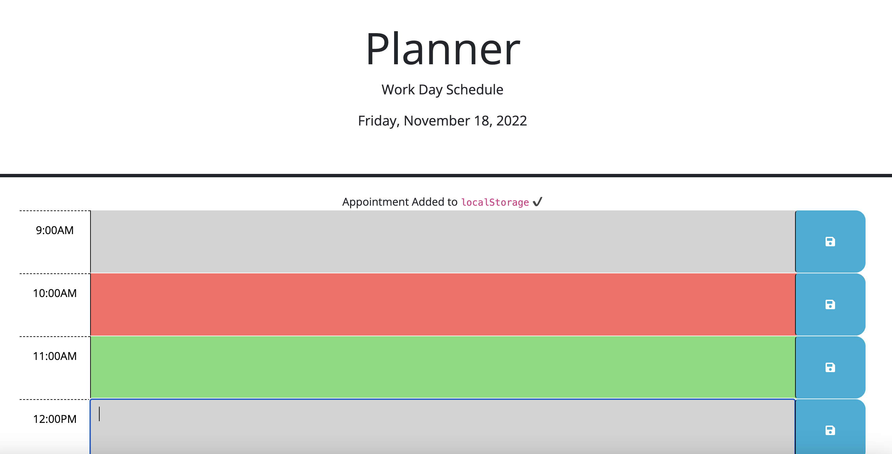

# Planner

## Description

Using Day.js, we created a dynamic planner for work hours. I attempted to demonstrate my knowledge of javascript/day.js/jquery during this challenge. 

## Usage

Use the containers to create entries in the calendar

## Credits

Challenge 5 Module
Tutor sessions
https://www.youtube.com/watch?v=vzGzys3enCE

## Submission

Github: https://github.com/apietsch4117/Planner
Deployed Page: https://apietsch4117.github.io/Planner/
